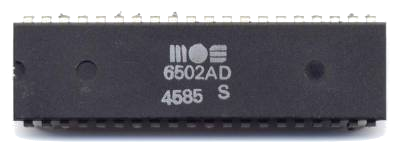
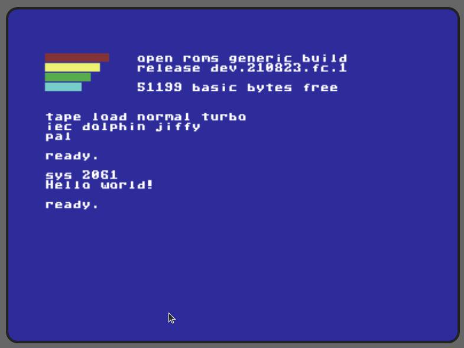

# 6502 Programming in C

## What is the 6502?



From [Wikipedia](https://en.wikipedia.org/wiki/MOS_Technology_6502):

> The MOS Technology 6502 (typically pronounced “sixty-five-oh-two”) is an 8-bit microprocessor that was designed by a small team led by Chuck Peddle for MOS Technology. The design team had formerly worked at Motorola on the Motorola 6800 project; the 6502 is essentially a simplified, less expensive and faster version of that design.
>
> When it was introduced in 1975, the 6502 was the least expensive microprocessor on the market by a considerable margin. It initially sold for less than one-sixth the cost of competing designs from larger companies, such as the 6800 or Intel 8080. Its introduction caused rapid decreases in pricing across the entire processor market. Along with the Zilog Z80, it sparked a series of projects that resulted in the home computer revolution of the early 1980s.
>
> Popular video game consoles and home computers of the 1980s and early 1990s, such as the Atari 2600, Atari 8-bit computers, Apple II, Nintendo Entertainment System, Commodore 64, Atari Lynx, BBC Micro and others, use the 6502 or variations of the basic design. Soon after the 6502's introduction, MOS Technology was purchased outright by Commodore International, who continued to sell the microprocessor and licenses to other manufacturers. In the early days of the 6502, it was second-sourced by Rockwell and Synertek, and later licensed to other companies.
>
> In 1981, the Western Design Center started development of a CMOS version, the 65C02. This continues to be widely used in embedded systems, with estimated production volumes in the hundreds of millions.

## Installation

This assumes a Debian-based system.

```bash
sudo apt install cc65 cc65-doc
```

The following programs are installed (descriptions taken from <https://cc65.github.io/doc/>):


Program | Description
---------|----------
ar65 | Archiver for object files generated by ca65. It allows to create archives, add or remove modules from archives, and to extract modules from existing archives.
ca65 | Macro assembler for the 6502, 65C02, and 65816 CPUs. It is used as a companion assembler for the cc65 crosscompiler, but it may also be used as a standalone product.
cc65 | C compiler for 6502 targets. It supports several 6502-based home computers such as the Commodore and Atari machines, but it easily is retargetable.
chrcvt65 | Vector font converter. It is able to convert a foreign font into the native format.
cl65 | Compile & link utility for cc65, the 6502 C compiler. It was designed as a smart frontend for the C compiler (cc65), the assembler (ca65), the object file converter (co65), and the linker (ld65).
co65 | Object file conversion utility. It converts o65 object files into the native object file format used by the cc65 tool chain. Since o65 is the file format used by cc65 for loadable drivers, the co65 utility allows (among other things) to link drivers statically to the generated executables instead of loading them from disk.
da65 | 6502/65C02 disassembler that is able to read user-supplied information about its input data, for better results. The output is ready for feeding into ca65, the macro assembler supplied with the cc65 C compiler.
grc65 | A compiler that can create GEOS headers and menus for cc65-compiled programs.
ld65 | The linker combines object files into an executable file. ld65 is highly configurable and uses configuration files for high flexibility.
od65 | Object file dump utility. It is able to output most parts of ca65-generated object files in readable form.
sim65 | Simulator for 6502 and 65C02 CPUs. It allows to test target independent code.
sp65 | Sprite and bitmap utility that is part of the cc65 development suite. It is used to convert graphics and bitmaps into the target formats of the supported machines.

## Get Started

Of course we'll start with the ubiquitous “Hello, world”.

hello.c
```c
#include <stdio.h>
    
int main()
{
    printf("Hello, world!\n");
    
    return(0);
}
```

### Native

We can target our native platform (Linux) using the `gcc` compiler we're already familiar with:

```bash
gcc hello.c -o hello
```

This gives us the following binary output:

```txt
hello  ELF 64-bit LSB pie executable
```

### 6502

To target the 6502 processor, we use `cl65` instead:

```bash
cl65 hello.c
```

This produces two output files:

```txt
hello.o   xo65 object
hello     Commodore 64 program
```

The default target is Commodore 64, but you can specify a different platform with the -t argument. The Apple II, for example:

```bash
cl65 -t apple2 hello.c
```

Output:

```txt
hello   AppleSingle encoded Macintosh file
```

To see all of the available platforms, use –list-targets:

```bash
cl65 --list-targets
```

### Testing

If you want to test your binary, use `sim6502` as your target:

```bash
cl65 --target sim6502 hello.c
```

```txt
hello   sim65 executable, version 2, 6502
```

Test using `sim65`:

```bash
sim65 hello
```

```txt
Hello, world!
```

You can get some additional info with the -v (verbose) argument:

```bash
sim65 -v hello
```

```txt
Loaded 'hello' at $0200-$0AE6
File version: 2
Reset: $0200
Hello, world!
PVExit ($00)
```

## Detailed Example

The compile and link utility (cl65) simplifies the process of building a binary by combining multiple build steps into one. For this section, we'll perform those steps individually.

We'll start with another “Hello world!” example, but with a few tweaks to the hello.c source:

hello.c
```c
#include <stdio.h>
    
extern const char text[];
    
int main() {
    printf("%s\n", text);
    
    return (0);
}
```

You'll notice that our “Hello world!” text doesn't appear in the source. Instead, we have a `const char text[]` declaration. The `extern` qualifier is a hint: We'll actually define our text in a separate assembly file:

text.s
```asm
.export _text
_text:  .asciiz "Hello world!"
```

With both files in place, we're ready to compile using `cc65`. I'm targeting Commodore 64 and I've also added a -O argument to optimize the output:

```bash
cc65 -O -t c64 hello.c
```

This will generate a `hello.s` assembly file:

hello.s
```asm
;
; File generated by cc65 v 2.18 - Ubuntu 2.19-1
;
    .fopt		compiler,"cc65 v 2.18 - Ubuntu 2.19-1"
    .setcpu		"6502"
    .smart		on
    .autoimport	on
    .case		on
    .debuginfo	off
    .importzp	sp, sreg, regsave, regbank
    .importzp	tmp1, tmp2, tmp3, tmp4, ptr1, ptr2, ptr3, ptr4
    .macpack	longbranch
    .forceimport	__STARTUP__
    .import		_printf
    .import		_text
    .export		_main
    
.segment	"RODATA"
    
L0003:
    .byte	$25,$53,$0D,$00
    
; ---------------------------------------------------------------
; int __near__ main (void)
; ---------------------------------------------------------------
    
.segment	"CODE"
    
.proc	_main: near
    
.segment	"CODE"
    
    lda     #<(L0003)
    ldx     #>(L0003)
    jsr     pushax
    lda     #<(_text)
    ldx     #>(_text)
    jsr     pushax
    ldy     #$04
    jsr     _printf
    ldx     #$00
    txa
    rts
    
.endproc
```

Now we can take our two assembly files (the one we created from scratch, and the one we generated) and build object files from them using the macro assembler:

```bash
ca65 hello.s
ca65 -t c64 text.s
```

```txt
hello.o    xo65 object, version 17, no debug info
text.o     xo65 object, version 17, no debug info
```

Finally, we use the linker to create our executable:

```bash
ld65 -o hello -t c64 hello.o text.o c64.lib
```

```txt
hello   Commodore C64 program
```

### Makefile

Here's a Makefile, if you'd like to simplify those steps:

Makefile
```makefile
TARGET = c64
    
COMPILER = cc65
ASSEMBLER = ca65
LINKER = ld65
    
default:
    @echo 'Targets:'
    @echo '  build'
    @echo '  clean'
    
build: hello
    
hello: hello.o text.o
    $(LINKER) -o hello -t $(TARGET) hello.o text.o $(TARGET).lib
    
hello.o: hello.s
    $(ASSEMBLER) hello.s
    
text.o: text.s
    $(ASSEMBLER) -t $(TARGET) text.s
    
hello.s: hello.c
    $(COMPILER) -O -t $(TARGET) hello.c
    
clean:
    @rm -f hello.s
    @rm -f *.o
    @rm -f hello
```

### Testing

The 8-bit Workshop IDE provides a quick and easy way to test your binary.

1. Go to <https://8bitworkshop.com/>
2. Click the “Open 8bitworkshop IDE” button.
3. Open the systems dropdown list in the upper-left corner of the screen and select “Computers”, “Commodore 64”
4. Click the menu button next to the systems dropdown and select “Upload”.
5. Browse to your hello binary and click “Open”.
6. The IDE will ask if you'd like to open 'hello' as your main project file. Click “Open As New Project”.

The binary will be loaded and you should see output similar to this:



## Next Steps

If you'd like to learn more, here are some sites to visit:

* The [cc65 repo](https://github.com/cc65/cc65) has lots of sample code.
* The [cc65 website](https://cc65.github.io/) has a lot of information, including links to [detailed documentation](https://cc65.github.io/doc/) and the [repo wiki](https://github.com/cc65/wiki/wiki).
* [8bitworkshop](https://8bitworkshop.com/) is a treasure trove of information about programming for old systems, including books and an online IDE where you can write code and see it emulated in real-time.
