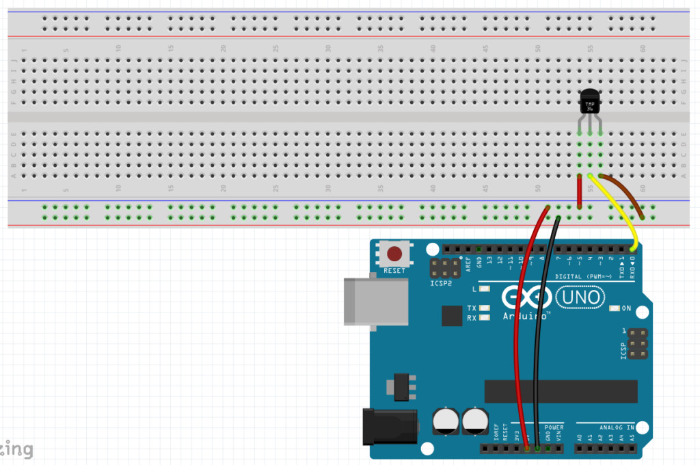
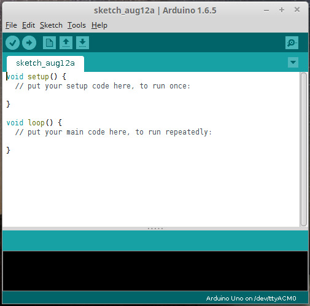
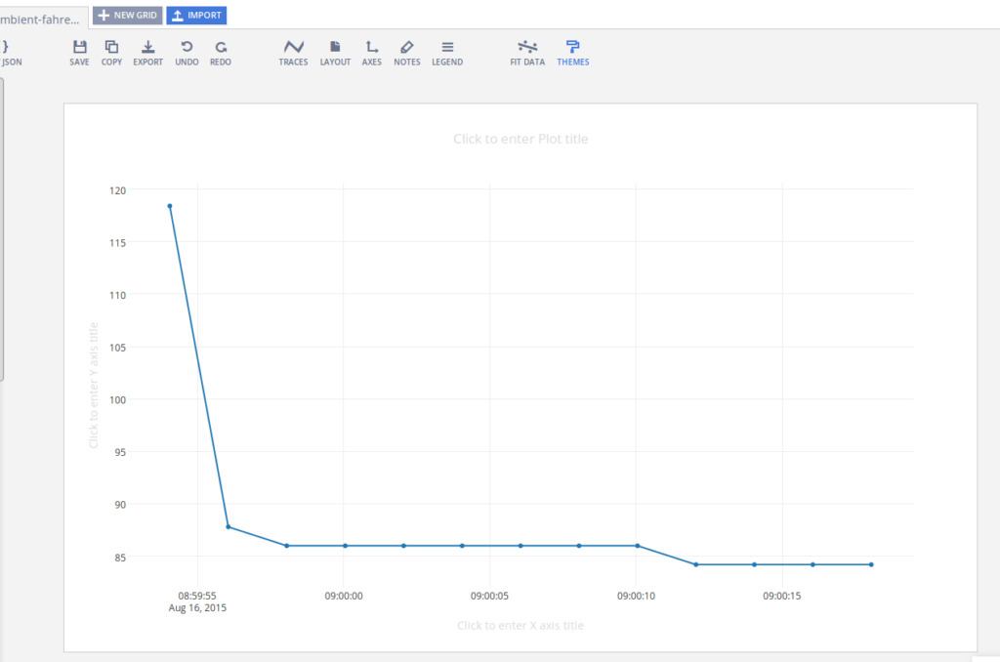

# Arduino / Raspberry Pi Remote Sensor

This project will provide an introduction to the concept of the “Internet_of_Things”.

> [Technopedia](http://www.techopedia.com) defines Internet of Things as:
>
> …a computing concept that describes a future where everyday physical objects will be connected to the Internet and be able to identify themselves to other devices. The term is closely identified with RFID as the method of communication, although it also may include other sensor technologies, wireless technologies or QR codes.
>
> The IoT is significant because an object that can represent itself digitally becomes something greater than the object by itself. No longer does the object relate just to you, but is now connected to surrounding objects and database data. When many objects act in unison, they are known as having “ambient intelligence.”

Specifically, we will program a device to provide temperature data, and then make that data publicly available on the web.

(If you’d like to save some time typing in scripts, you can download them [here](https://github.com/jfcarr-hardware/arduino-raspberry-pi-remote-sensor).)

## Architecture

Our component architecture will be as follows:

* The physical layer will be used to capture the temperature data. We will implement this using an Arduino Uno board and a temperature sensor.
* The coordination layer will be used to capture the temperature measurements from the physical layer and for sending the measurements to our application. This will be implemented using Node.js running on a Raspberry Pi. We will also use the Raspberry Pi as a development platform for the Arduino.
* The application layer will be used to visualize the measurements in real-time. This will be implemented using a data visualization cloud service called Plotly.

> [!NOTE]
> This guide assumes that you already have your Raspberry Pi up and running.

## Required Hardware

* [Raspberry Pi](https://www.sparkfun.com/products/12994) If you tweak the instructions a bit, it’s not difficult to use a desktop PC or laptop instead of a Raspberry Pi. (Probably easier, in fact.) I’m using a Raspberry Pi – B+, not a Raspberry 2. You can probably use a different model, I just haven’t tried it.
* [Arduino](https://www.sparkfun.com/products/11021) with USB cable. I’m using an Arduino Uno. As with the Raspberry Pi, you can probably use a different model.
* [breadboard](https://www.sparkfun.com/products/12002)
* [TMP36 temperature sensor](https://www.sparkfun.com/products/10988) Similar sensors don’t necessarily report the same temperature data, so keep that in mind if you make a substitution here. For example, the TMP36 reports data in Celsius, whereas the TMP35 reports in Kelvin.
* [jumper wires](https://www.sparkfun.com/products/11710) (5)

## Arduino Configuration

Wire up the Arduino as follows:



(I created this breadboard layout image in [Fritzing](http://fritzing.org).)

It’s a very simple setup. We provide power to the temperature sensor, and the sensor returns temperature data via digital pin 0.

## Arduino IDE

To write code and upload it to the Arduino board, you’ll need the free Arduino IDE.



Versions are available for Windows, Mac, and Linux. Since we’re running it on the Raspberry Pi, we’ll be using the Linux version.

1) If you want the latest version, download and install it from [here](https://www.arduino.cc/en/Main/Software).

2) If using the latest version isn’t important to you (it isn’t required), you can install it from a terminal prompt using apt-get:

```bash
sudo apt-get install arduino
```

The Arduino IDE does have a few dependencies, and required about 80MB on my Raspberry Pi.

After you install the IDE, plug in the Arduino using the supplied USB cable, then run the IDE.

1. Open the “Tools” menu, go to the “Board” section and make sure your Arduino model is selected.
2. In the “Serial Port” section, make sure the serial port value is selected. Also, note the value of the serial port string. You’ll need it later. (It will look something like this: "/dev/ttyACM0")

## Processing source

Code for the Arduino is written in [Processing](https://en.wikipedia.org/wiki/Processing_%28programming_language%29). Processing is syntactically very similar to the C, C++, and Java languages. A code module for the Arduino is called a “sketch”.

This is the code we’ll use to get data from the temperature sensor. Type this code into the sketch editor in the Arduino IDE:

```c
/* This is the pin getting the stream of temperature data. */
#define sensorPin 0
	
float Celsius, Fahrenheit;
int sensorValue;
	
void setup() {
	Serial.begin(9600);  /* Initialize the Serial communications */
}
	
void loop() {
	
	GetTemp();
	
	Serial.println(Fahrenheit);  /* You can easily change this to print Celsius if you want. */
	
	delay(2000);  /* Wait 2 seconds before getting the temperature again. */
}
	
void GetTemp() {
	sensorValue = analogRead(sensorPin);  /* Get the current temperature from the sensor. */
	
	/*
	* The data from the sensor is in mV (millivolts), where 10mV = 1 degree Celsius.
	* So if, for example, you receive a value of 220 from the sensor, this indicates
	* a temperature of 22 degrees Celsius.
	*/
	
	Celsius = sensorValue / 10;         /* Convert the sensor value to Celsius */
	Fahrenheit = (Celsius * 1.8) + 32;  /* Convert the Celsius value to Fahrenheit */
}

```

After you’ve typed in this source code, click the “Verify” button in the toolbar to check the syntax. If you’ve made any mistakes, correct them before continuing.

Once the code is verified, click the “Upload” button in the toolbar to write it to the Arduino’s flash memory.

## Running with serial monitor

Once the sketch has been written to the Arduino, it will start running automatically. You can check the values being received from the temperature sensor by opening the serial monitor in the Arduino IDE. To do that, click the “Serial Monitor” button on the right side of the toolbar. A console window will open up, and you should see a stream of data similar to this:

```txt
86.0
86.0
86.2
86.2
86.0
85.8
85.8
85.8
```

> [!NOTE]
> You may see values lower or higher than this. (The sensor on my Arduino seems to run a little hot.)

Now that we have the Arduino supplying temperature data, the next step is to make it available on the web.

## Plotly account

Plotly is an online analytics and data visualization tool. It provides online graphing, analytics, and stats tools for individuals and collaboration, as well as scientific graphing libraries for Python, R, MATLAB, Perl, Julia, Arduino, and REST.

It also has a streaming API, which we’ll use to get our data to the web.

To set up a free Plotly account, go to the Plotly home page [here](https://plot.ly). After you create your account, there are three pieces of information you’ll need to remember. We’ll be using them later:

* Username
* API key
* Streaming API token

## Node.js

To get our data from the Arduino to Plotly, we’ll use Node.js.

> Node.js is an open source, cross-platform runtime environment for server-side and networking applications. Node.js applications are written in JavaScript and can be run within the Node.js runtime on OS X, Microsoft Windows, Linux, and a handful of other operating systems.

First, make sure your system is up-to-date. Open a terminal and issue the following command:

```bash
sudo apt-get update

sudo apt-get upgrade -y
```

(Probably a good idea to reboot after this.)

Then, download and install node.js:

For the **wget** step, the latest as of this writing seems to be <http://nodejs.org/dist/v0.11.9/>, but I was not able to get this version to work. I used <http://nodejs.org/dist/v0.10.16/>.

```bash
wget http://nodejs.org/dist/v0.10.16/node-v0.10.16-linux-arm-pi.tar.gz

tar xvfz node-v0.10.16-linux-arm-pi.tar.gz

sudo mv node-v0.10.16-linux-arm-pi /opt/node/
```

> [!IMPORTANT]
> You need to retrieve the version from nodejs.org. The version in the repository does not work, so you can’t use apt-get to install it.

Configure your path:

```bash
echo 'export PATH="$PATH:/opt/node/bin"' >> ~/.bashrc
 
source ~/.bashrc
```

## Node.js project setup

Open a terminal, and create a directory for your Node.js project. Change your working directory to the new directory. Example:

```bash
mkdir temp_nodejs
 
cd temp_nodejs
```

We’ll need a couple of additional libraries for our Node.js project, serialport and plotly. Install them using the following commands in your project folder:

```bash
npm install serialport
 
npm install plotly
```

If you get a “failed to fetch from registry” error when you try to use npm install, you may need to make the following change on your Raspberry Pi:

```bash
npm config set registry http://registry.npmjs.org/
```

(By default, npm install uses <https://registry.npmjs.org>)

Now we’re ready to create the Javascript file for Node.js to execute. Use the following as a template:

```javascript
var serialport = require('serialport'),
		plotly = require('plotly')('Plotly_UserName', 'Plotly_API'),
		token = 'Plotly_Token';
var portName = '/dev/tty.usbmodem1411';
var sp = new serialport.SerialPort(portName, {
	baudRate: 9600,
	dataBits: 8,
	parity: 'none',
	stopBits: 1,
	flowControl: false,
	parser: serialport.parsers.readline("\r\n")
});
	
// helper function to get a nicely formatted date string
function getDateString() {
	var time = new Date().getTime();
	// 32400000 is (GMT+9 Japan)
	// for your timezone just multiply +/-GMT by 36000000
	var datestr = new Date(time + 32400000).toISOString().replace(/T/, ' ').replace(/Z/, '');
	return datestr;
}
	
var initdata = [{x: [], y: [], stream: {token: token, maxpoints: 500}}];
var initlayout = {fileopt: "extend", filename: "ambient-fahrenheit-temperature-sensor"};
	
plotly.plot(initdata, initlayout, function (err, msg) {
	if (err)
		return console.log(err)
	
	console.log(msg);
	var stream = plotly.stream(token, function (err, res) {
		console.log(err, res);
	});
	
	sp.on('data', function (input) {
		if (isNaN(input) || input > 1023)
			return;
	
		var streamObject = JSON.stringify({x: getDateString(), y: input});
		console.log(streamObject);
		stream.write(streamObject + '\n');
	});
});
```

> [!IMPORTANT]
> Make sure you change the **portName** value to match the serial port value from our “Arduino IDE” step. Also, change the **Plotly_UserName**, **Plotly_API**, and **Plotly_Token** text to match the values from the Plotly account you opened.

## Node Server

Make sure your Arduino board is plugged in, then start your Node.js server by issuing the following command:

```bash
node server.js
```

You should see information similar to the following:

```txt
{ streamstatus: 'All Streams Go!',
  url: 'https://plot.ly/~username/44',
  message: '',
  warning: '',
  filename: 'ambient-fahrenheit-temperature-sensor',
  error: '' }
{"x":"2015-08-16 08:55:57.418","y":"87.80"}
{"x":"2015-08-16 08:55:59.417","y":"86.00"}
{"x":"2015-08-16 08:56:01.415","y":"86.00"}
{"x":"2015-08-16 08:56:03.414","y":"86.00"}
{"x":"2015-08-16 08:56:05.413","y":"86.00"}
```

This indicates that the Node.js server is receiving data from the Arduino board and sending it to Plotly. The server will continue to log data until you press [Ctrl-C] to stop it.

## Plotly View

While the Node.js server is running, open a web browser and log in to your Plotly account. Click the “Organize” link at the top of the screen, then click the “Open Plot” button on the “ambient-fahrenheit-temperature-sensor” project.

After the project opens, you should see a graph similar to this, updating in real-time:



Plotly projects are public by default, so you are now sharing your real-time temperature data with the world!

> If you’re wondering about that high first value, I’ve noticed that the first one or two values tend to be anomalous. This may be related to the sketch being initialized, the initial board reset, or something else.

## Summary

Using some inexpensive, low-powered hardware, we were able to provide some (somewhat) useful information on the web for public consumption.

Hopefully this will inspire you to create some IoT projects of your own. Good luck!