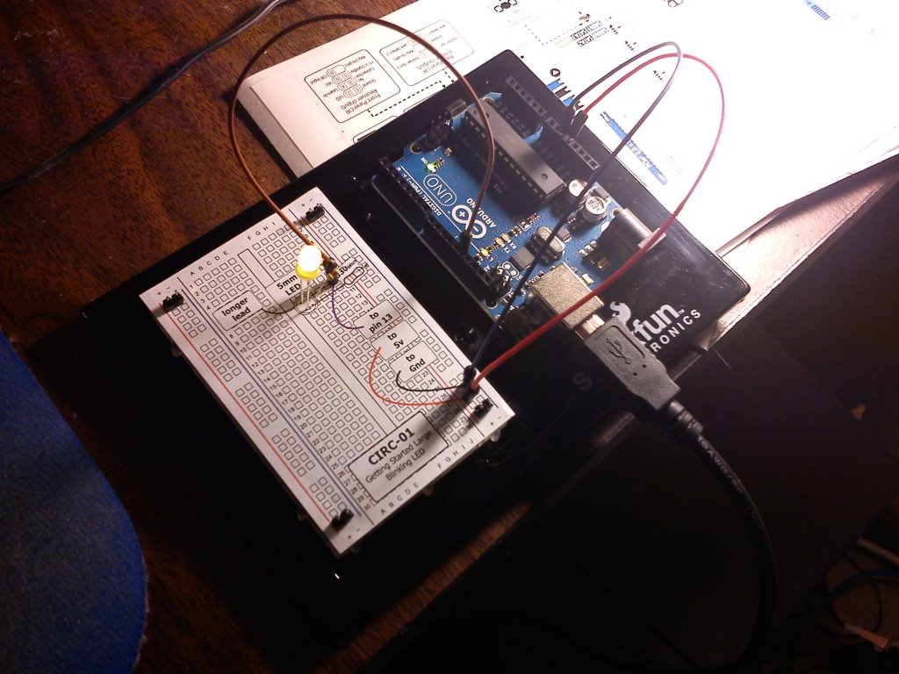

# Basic Arduino Uno Dev Setup in Linux (Debian-based)

Getting a basic development environment for the Arduino Uno up and running in Linux is straightforward. This uses the Arduino IDE.

1. Open up Synaptic and install the “arduino” package.  This will also install “arduino-core” and other dependencies.
2. Grab your arduino, a breadboard, some wires, a resistor, and an LED, and wire up a quick test.  (I used the CIRC-01 project from the Sparkfun Inventor’s Kit guide).
3. Connect the Arduino USB cable to your PC, then plug in the Arduino board.
4. Start up the Arduino IDE.
5. Go to “Tools”, “Board”, and make sure “Arduino Uno” is selected.
6. Go to “Tools”, “Serial Port” and select the port that your Arduino board is using.
7. Go to “File”, “Examples”, “Basics” and click “Blink”.  This will load a very simple bit of code that will cause the LED you wired up to blink on and off.
8. Click the “Upload” button.  If all is well, then the LED on the breadboard should start blinking.

