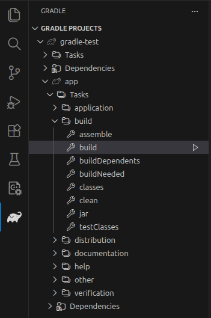
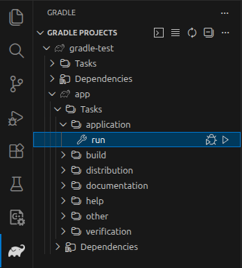
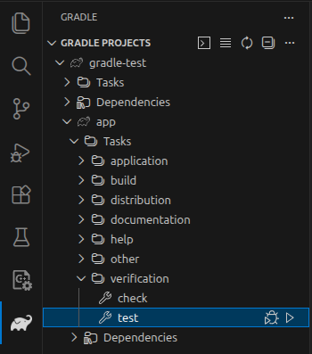

# Gradle Quick Start

Gradle is a build automation tool used mainly for Java, Android, and JVM-based projects, but it can build almost any type of software.

* **Purpose:** Automates compiling code, running tests, packaging apps (e.g., JAR/APK), publishing artifacts, and running custom tasks.
* **Language:** Build scripts are written in Groovy or Kotlin (files like build.gradle or build.gradle.kts).
* **Dependency management:** Automatically downloads and manages libraries from repositories like Maven Central.
* **Performance:** Uses incremental builds and build caching to avoid redoing work, making builds faster.
* **Extensible:** Has a rich plugin system (e.g., Java plugin, Android plugin) and allows you to write custom tasks.

## Installation

### Prerequisites

* Any major operating system
* [Java Development Kit](https://jdk.java.net/) (JDK) version 17 or higher 

> [!NOTE]
> Gradle supports Kotlin and Groovy as the main build languages. Gradle ships with its own Kotlin and Groovy libraries, therefore they do not need to be installed. Existing installations are ignored by Gradle.

### Linux Installation (manual)

**Step 1 - [Download](https://gradle.org/releases) the latest Gradle distribution**

The distribution ZIP file comes in two flavors: Binary-only and Complete.  I'll be installing the Binary-only version.

**Step 2 - Unpack the distribution**

Unzip the distribution zip file in the directory of your choosing, e.g.:

```bash
sudo mkdir /opt/gradle

sudo unzip -d /opt/gradle gradle-9.3.1-bin.zip
```

**Step 3 - Configure your system environment**

```bash
export PATH=$PATH:/opt/gradle/gradle-9.3.1/bin
```

### Verify the installation

```bash
gradle -v
```

Output will be similar to this:

```txt
------------------------------------------------------------
Gradle 9.3.0
------------------------------------------------------------

Build time:    2026-01-16 11:14:22 UTC
Revision:      701205ed2f78811508466c8e1952304c2ea869f5

Kotlin:        2.2.21
Groovy:        4.0.29
Ant:           Apache Ant(TM) version 1.10.15 compiled on August 25 2024
Launcher JVM:  21.0.9 (Ubuntu 21.0.9+10-Ubuntu-124.04)
Daemon JVM:    /usr/lib/jvm/java-21-openjdk-amd64 (no Daemon JVM specified, using current Java home)
OS:            Linux 6.14.0-37-generic amd64
```

## IDE Setup

I'll be using [Visual Studio Code](https://code.visualstudio.com/download) as my IDE.  If you're using something different (e.g., Intellij), it shouldn't be difficult to adapt.

Install these VS Code extensions:

Extension | Publisher | Marketplace Link
--------- | --------- | ----------------
Language Support for Java by Red Hat | Red Hat | <https://marketplace.visualstudio.com/items?itemName=redhat.java>
Debugger for Java | Microsoft | <https://marketplace.visualstudio.com/items?itemName=vscjava.vscode-java-debug>
Gradle for Java | Microsoft | <https://marketplace.visualstudio.com/items?itemName=vscjava.vscode-gradle>
Project Manager for Java | Microsoft | <https://marketplace.visualstudio.com/items?itemName=vscjava.vscode-java-dependency>
Test Runner for Java | Microsoft | <https://marketplace.visualstudio.com/items?itemName=vscjava.vscode-java-test>

## Initialize a Project

```bash
mkdir project-name

cd project-name
```

Then:

```bash
gradle init --type java-application  --dsl kotlin
```

(Accept the defaults)

Valid `--type` values:

Type | Description
---- | -----------
pom | Converts an existing Apache Maven build to Gradle
basic | A basic, empty, Gradle build
java-application | A command-line application implemented in Java
java-gradle-plugin | A Gradle plugin implemented in Java
java-library | A Java library
kotlin-application | A command-line application implemented in Kotlin/JVM
kotlin-gradle-plugin | A Gradle plugin implemented in Kotlin/JVM
kotlin-library | A Kotlin/JVM library
groovy-application | A command-line application implemented in Groovy
groovy-gradle-plugin | A Gradle plugin implemented in Groovy
groovy-library | A Groovy library
scala-application | A Scala application
scala-library | A Scala library
cpp-application | A command-line application implemented in C++
cpp-library | A C++ library

Valid `--dsl` values: **kotlin** and **groovy**.

## Project Details

The Gradle configuration details can be found in **app/build.gradle.kts**:

```kotlin
/*
 * This file was generated by the Gradle 'init' task.
 *
 * This generated file contains a sample Java application project to get you started.
 * For more details on building Java & JVM projects, please refer to https://docs.gradle.org/9.3.0/userguide/building_java_projects.html in the Gradle documentation.
 */

plugins {
    // Apply the application plugin to add support for building a CLI application in Java.
    application
}

repositories {
    // Use Maven Central for resolving dependencies.
    mavenCentral()
}

dependencies {
    // Use JUnit Jupiter for testing.
    testImplementation(libs.junit.jupiter)

    testRuntimeOnly("org.junit.platform:junit-platform-launcher")

    // This dependency is used by the application.
    implementation(libs.guava)
}

// Apply a specific Java toolchain to ease working on different environments.
java {
    toolchain {
        languageVersion = JavaLanguageVersion.of(21)
    }
}

application {
    // Define the main class for the application.
    mainClass = "org.example.App"
}

tasks.named<Test>("test") {
    // Use JUnit Platform for unit tests.
    useJUnitPlatform()
}
```

A main class is generated in **app/src/main/java/org/example/App.java**:

```java
/*
 * This source file was generated by the Gradle 'init' task
 */
package org.example;

public class App {
    public String getGreeting() {
        return "Hello World!";
    }

    public static void main(String[] args) {
        System.out.println(new App().getGreeting());
    }
}
```

A unit test is generated in **app/src/test/java/org/example/AppTest.java**:

```java
/*
 * This source file was generated by the Gradle 'init' task
 */
package org.example;

import org.junit.jupiter.api.Test;
import static org.junit.jupiter.api.Assertions.*;

class AppTest {
    @Test void appHasAGreeting() {
        App classUnderTest = new App();
        assertNotNull(classUnderTest.getGreeting(), "app should have a greeting");
    }
}
```

## Gradle Wrapper

The generated project includes Gradle wrapper shell (`gradlew`) and batch (`gradlew.bat`) scripts. These allow anyone to build the project without having to install Gradle manually.

You can see all of the tasks that the Gradle wrapper is configured to run within a specific project by invoking it like this:

```bash
./gradlew tasks
```

Example output (abbreviated):

```txt
> Task :tasks

------------------------------------------------------------
Tasks runnable from root project 'gradle-test'
------------------------------------------------------------

Application tasks
-----------------
run - Runs this project as a JVM application

Build tasks
-----------
assemble - Assembles the outputs of this project.
build - Assembles and tests this project.
buildDependents - Assembles and tests this project and all projects that depend on it.
buildNeeded - Assembles and tests this project and all projects it depends on.
classes - Assembles main classes.
clean - Deletes the build directory.
jar - Assembles a jar archive containing the classes of the 'main' feature.
testClasses - Assembles test classes.

Build Setup tasks
-----------------
init - Initializes a new Gradle build.
updateDaemonJvm - Generates or updates the Gradle Daemon JVM criteria.
wrapper - Generates Gradle wrapper files.

Distribution tasks
------------------
assembleDist - Assembles the main distributions
distTar - Bundles the project as a distribution.
distZip - Bundles the project as a distribution.
installDist - Installs the project as a distribution as-is.

Documentation tasks
-------------------
javadoc - Generates Javadoc API documentation for the 'main' feature.
```

## Build the Project

Using the Gradle wrapper (in the project directory):

```bash
./gradlew build
```

Using the Gradle runner in VS Code:



## Run the Project

Using the Gradle wrapper:

```bash
./gradlew run
```

Using the Gradle runner in VS Code:



Output:

```txt
> Task :app:run
Hello World!

BUILD SUCCESSFUL in 1s
2 actionable tasks: 1 executed, 1 up-to-date
Configuration cache entry reused.
```

## Run Unit Tests

Using the Gradle wrapper:

```bash
./gradlew test
```

Using the Gradle runner in VS Code:



Output:

```txt
BUILD SUCCESSFUL in 1s
3 actionable tasks: 3 up-to-date
Configuration cache entry stored.
```

## Fat Jar

If you want to generate a "fat jar" (a .jar file that contains your application and also all dependencies), first add this to **app/build.gradle.kts**:

```kotlin
tasks.jar {
    manifest {
        attributes["Main-Class"] = application.mainClass.get()
    }
    from({
        configurations.runtimeClasspath.get().map {
            if (it.isDirectory) it else zipTree(it)
        }
    })
    duplicatesStrategy = DuplicatesStrategy.EXCLUDE
}
```

Then, build your .jar file with this:

```bash
./gradlew jar
```

Finally, run your .jar with this:

```bash
java -jar app/build/libs/app.jar
```

## Links

### Gradle Home Page

Description | URL
----------- | ---
Home Page | <https://gradle.org>
Gradle downloads | <https://gradle.org/releases>
Gradle User Manual | <https://docs.gradle.org/current/userguide/userguide.html>
Installation guide | <https://docs.gradle.org/current/userguide/installation.html>
Beginner tutorial | <https://docs.gradle.org/current/userguide/part1_gradle_init.html>

### Other

Description | URL
----------- | ---
**Oracle Java:** Oracle's Java distribution, with Oracle-specific licenses and subscriptions. | <https://www.oracle.com/java/>
**OpenJDK:** Open-source reference implementation of Java. Free to use and redistribute. | <https://openjdk.org/>
**Kotlin:** A general-purpose programming language derived from Java. | <https://kotlinlang.org/>
**Apache Groovy:** A Java-syntax-compatible object-oriented programming language for the Java platform. | <https://groovy-lang.org/>
**Maven Central:** Public repository for Java and JVM artifacts used by Apache Maven, Gradle, and other build tools. | <https://central.sonatype.com>
