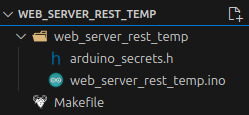

# Implement a REST Service on a Nano RP2040

The is an Arduino Nano board with a Raspberry Pi RP2040 microcontroller that supports Bluetooth, WiFi, and machine learning. It has an onboard accelerometer, gyroscope, microphone, and temperature sensor.

With the built-in sensors and WiFi, it's a good candidate for a remote monitoring solution. We'll implement a simple REST service that returns the current temperature.

# Toolset

Here's what I'll be using:

* [Nano RP2040 board with a micro USB cable](https://www.amazon.com/dp/B095J4KFVT)
* [Arduino CLI](https://docs.arduino.cc/arduino-cli/)
* [Visual Studio Code](https://code.visualstudio.com/) with the [Arduino Community Edition extension](https://marketplace.visualstudio.com/items?itemName=vscode-arduino.vscode-arduino-community). This is a community fork of Microsoft's ([deprecated](https://github.com/microsoft/vscode-arduino/issues/1757)) Arduino extension.

# Board Setup

Plug in your Nano RP2040 board and issue the following command:

```bash
arduino-cli board list
```

You should see something like this:

```txt
Port         Protocol Type              Board Name                  FQBN                                Core
/dev/ttyACM0 serial   Serial Port (USB) Arduino Nano RP2040 Connect arduino:mbed_nano:nanorp2040connect arduino:mbed_nano
```

You will probably need to install the core:

```bash
arduino-cli core install arduino:mbed_nano
```

We'll be using three additional libraries:

Name | Description
---- | -----------
Arduino_LSM6DSOX | Access the IMU for accelerometer, gyroscope, and embedded temperature sensor.
ArduinoJson | A simple and efficient JSON library for embedded C++.
WiFiNINA | With this library you can instantiate Servers, Clients and send/receive UDP packets through WiFi.

Install them:

```bash
arduino-cli lib install Arduino_LSM6DSOX

arduino-cli lib install ArduinoJson

arduino-cli lib install WiFiNINA
```

# Project Structure / Setup

Create a directory named **web_server_rest_temp**.

Open the directory in VS Code.

Create a Makefile containing the following content:

```make
ARDCMD=arduino-cli
FQBNSTR=arduino:mbed_nano:nanorp2040connect
PORT=/dev/ttyACM0
SKETCHNAME=web_server_rest_temp

default:
	@echo 'Targets:'
	@echo '  compile  -- Compile sketch, but don''t upload it.'
	@echo '  upload   -- Compile and upload sketch.'
	@echo '  monitor  -- Open the serial port monitor.'

compile:
	$(ARDCMD) compile --fqbn $(FQBNSTR) $(SKETCHNAME)

upload: compile
	$(ARDCMD) upload -p $(PORT) --fqbn $(FQBNSTR) $(SKETCHNAME)

monitor:
	$(ARDCMD) monitor -p $(PORT)

```

You can type out individual commands for compiling, uploading, and monitoring instead, but using a Makefile is more convenient.

Create a subdirectory, also named **web_server_rest_temp**.

In the subdirectory, create a file named **arduino_secrets.h** containing the following contents:

```c
#define SECRET_SSID "wireless_network_name"           // The name of your wireless network
#define SECRET_PASSWORD "wireless_network_password"   // The password for your wireless network
#define SECRET_PORT 8090                              // The port that the REST service will run on
```

Update the defines to match your network settings.

For example, if you have a wireless network named "MyHomeWifi" and you use the password "MyN3tw0rkP@ssw0rd" to connect to it, your **arduino_secrets.h** file would look like this:

```c
#define SECRET_SSID "MyHomeWifi"              // The name of your wireless network
#define SECRET_PASSWORD "MyN3tw0rkP@ssw0rd"   // The password for your wireless network
#define SECRET_PORT 8090                      // The port that the REST service will run on
```

In the same subdirectory, create a file named **web_server_rest_temp.ino** and give it the boilerplate Arduino contents:

```c
void setup()
{

}

void loop()
{

}
```

Your project layout should now look like this:



Keep **web_server_rest_temp.ino** open for editing.

# Main Sketch

We'll update **web_server_rest_temp.ino** incrementally and explain each update, then show a complete version at the end.

First, add your includes:

```c
#include "arduino_secrets.h"
#include <Arduino_LSM6DSOX.h>
#include <ArduinoJson.h>
#include <WiFiNINA.h>

```

Then, initialize network settings:

```c
char ssid[] = SECRET_SSID;     // network SSID (name)
char pass[] = SECRET_PASSWORD; // network password
int keyIndex = 0;              // network key index number (needed only for WEP)
int port = SECRET_PORT;
```

Set the initial status and instantiate the server:

```c
int status = WL_IDLE_STATUS;
WiFiServer server(port);
```

Inside `setup()`, initialize serial communication at 9600 baud. (The serial monitor uses this)

```c
Serial.begin(9600);
```

Make sure the [IMU](../glossary.md#inertial-measurement-unit-imu) is available:

```c
if (!IMU.begin())
{
	Serial.println("Failed to initialize IMU!");
	while (1)
		;
}
```

> An inertial measurement unit (IMU) is an electronic device that measures and reports a body's specific force, angular rate, and sometimes the orientation of the body, using a combination of accelerometers, gyroscopes, and sometimes magnetometers. When the magnetometer is included, IMUs are referred to as IMMUs.

Make sure the WiFi module is available:

```c
if (WiFi.status() == WL_NO_MODULE)
{
	Serial.println("Communication with WiFi module failed!");
	while (true)
		;
}
```

See if the WiFi firmware is up to date:

```c
String fv = WiFi.firmwareVersion();

if (fv < WIFI_FIRMWARE_LATEST_VERSION)
{
	Serial.println("Please upgrade the firmware");
}
```

If it isn't, then display a message, but still continue.

Connect to the WiFi network:

```c
while (status != WL_CONNECTED)
{
	Serial.print("Attempting to connect to Network named: ");
	Serial.println(ssid); // print the network name (SSID)

	status = WiFi.begin(ssid, pass);

	// wait 5 seconds for the connection:
	delay(5000);
}
```

Start the server, then print the WiFi status:

```c
server.begin();

printWifiStatus();
```

The `printWifiStatus()` function is a new custom function that we need to add.  It displays useful information about our new connection:

```c
void printWifiStatus()
{
    // print the SSID of the network you're attached to:
    Serial.print("SSID: ");
    Serial.println(WiFi.SSID());

    // print your board's IP address:
    IPAddress ip = WiFi.localIP();
    Serial.print("IP Address: ");
    Serial.println(ip);

    // print the received signal strength:
    long rssi = WiFi.RSSI();
    Serial.print("signal strength (RSSI): ");
    Serial.print(rssi);
    Serial.println(" dBm");
}
```

That concludes our `setup()` code.  Now we're ready to move on to `loop()`.

First, instantiate a `WiFiClient`.  It will listen for incoming clients:

```c
WiFiClient client = server.available();
```

Check to see when a client connects:

```c
if (client)
{

}
```

When a client connects, print a message, then initialize a String that will hold incoming data from the client:

```c
if (client)
{
	Serial.println("new client");

	String currentLine = "";
}
```

Prepare to perform some operations while the client is connected, but only while the client is still available:

```c
if (client)
{
	Serial.println("new client");

	String currentLine = "";

	while (client.connected())
	{
		if (client.available())
		{
		}
	}
}
```

Inside the `client.available()` block:

```c
// Read one character of the client request at a time:
char c = client.read();

// If the byte is a newline character:
if (c == '\n')
{
	// If currentline has been cleared, the request is finished, but it wasn't a known endpoint, so send a generic response:
	if (currentLine.length() == 0)
	{
		sendResponse(client, "Hello from Arduino RP2040! Valid endpoints are /Temperature/Current/F and /Temperature/Current/C", -99, "invalid");
		break;
	}
	else
		currentLine = ""; // If you got a newline, then clear currentLine
}
else if (c != '\r')
	// If you got anything else but a carriage return character, add it to the end of the currentLine:
	currentLine += c;
```

`sendResponse()` is another new custom function.  It receives the following as arguments:

- A reference to the WiFiClient,
- a text message,
- a value, and
- a status

Inside the function:

- A standard HTTP response is sent.
- A JSON document object is created.
- The JSON document is populated with the message, value, and status.
- The JSON object is serialized back to the client.

```c
void sendResponse(WiFiClient &client, char message[], int value, char status[])
{
    // Send a standard HTTP response
    client.println("HTTP/1.1 200 OK");
    client.println("Content-type: application/json");
    client.println("Connection: close");
    client.println();

    // Create a JSON object
    StaticJsonDocument<200> doc;

    doc["message"] = message;
    doc["value"] = value;
    doc["status"] = status;

    // Serialize JSON to client
    serializeJson(doc, client);
}
```

Returning to the `loop()` function, still inside the `client.available()` block, we now check to see if a specific endpoint was called by the client:

```c
char request_unit = 'X';
if (currentLine.indexOf("GET /Temperature/Current/F") != -1)
	request_unit = 'F';
if (currentLine.indexOf("GET /Temperature/Current/C") != -1)
	request_unit = 'C';
```

We use `request_unit` to track calls to specific endpoints.  If the client has asked for the current temperature in Fahrenheit or Celsius, we'll want to respond accordingly:

```c
if (request_unit == 'F' || request_unit == 'C')
{
	int current_temperature = (request_unit == 'F') ? getTemperature(true) : getTemperature(false);
	char temp_units[5];
	sprintf(temp_units, "°%s", (request_unit == 'F') ? "F" : "C");

	char message[50];
	sprintf(message, "Current temperature is %d %s", current_temperature, temp_units);

	sendResponse(client, message, current_temperature, "success");
	break;
}
```

If the client has asked for the temperature, we retrieve it with `getTemperature()`, format the data to return to the client, then send the response.

`getTemperature()` is another new function. It makes sure the IMU module is available, then retrieves the current temperature value from the IMU temperature sensor.  The IMU returns the temperature in Celsius units, so the value is converted to Fahrenheit, if requested.

```c
int getTemperature(bool as_fahrenheit)
{
    if (IMU.temperatureAvailable())
    {
        int temperature_deg = 0;
        IMU.readTemperature(temperature_deg);

        if (as_fahrenheit == true)
            temperature_deg = celsiusToFahrenheit(temperature_deg);

        return temperature_deg;
    }
    else
    {
        return -99;
    }
}
```

The `celsiusToFahrenheit()` function is also new:

```c
int celsiusToFahrenheit(int celsius_value)
{
  return (celsius_value * (9 / 5)) + 32;
}
```

Returning to the `loop()` function, after the `while (client.connected())` block, we perform some cleanup after the client disconnects:

```c
client.stop();
Serial.println("client disconnected");
```

And that's it!  Our full sketch (**web_server_rest_temp.ino**) now looks like this:

```c
#include "arduino_secrets.h"
#include <Arduino_LSM6DSOX.h>
#include <ArduinoJson.h>
#include <WiFiNINA.h>

char ssid[] = SECRET_SSID;     // network SSID (name)
char pass[] = SECRET_PASSWORD; // network password
int keyIndex = 0;              // network key index number (needed only for WEP)
int port = SECRET_PORT;

void setup()
{
    Serial.begin(9600);

    if (!IMU.begin())
    {
        Serial.println("Failed to initialize IMU!");
        while (1)
            ;
    }

    if (WiFi.status() == WL_NO_MODULE)
    {
        Serial.println("Communication with WiFi module failed!");
        while (true)
            ;
    }

    String fv = WiFi.firmwareVersion();

    if (fv < WIFI_FIRMWARE_LATEST_VERSION)
    {
        Serial.println("Please upgrade the firmware");
    }

    while (status != WL_CONNECTED)
    {
        Serial.print("Attempting to connect to Network named: ");
        Serial.println(ssid); // print the network name (SSID);

        // Connect to WPA/WPA2 network. Change this line if using open or WEP network:
        status = WiFi.begin(ssid, pass);
        // wait 5 seconds for connection:
        delay(5000);
    }

    server.begin();
    printWifiStatus();
}

void loop()
{
    WiFiClient client = server.available();

    if (client)
    {
        Serial.println("new client");

        String currentLine = "";

        while (client.connected())
        {
            if (client.available())
            {
                // Read one character of the client request at a time:
                char c = client.read();

                // If the byte is a newline character:
                if (c == '\n')
                {
                    // If currentline has been cleared, the request is finished, but it wasn't a known endpoint, so send a generic response:
                    if (currentLine.length() == 0)
                    {
                        sendResponse(client, "Hello from Arduino RP2040! Valid endpoints are /Temperature/Current/F and /Temperature/Current/C", -99, "invalid");
                        break;
                    }
                    else
                        currentLine = ""; // If you got a newline, then clear currentLine
                }
                else if (c != '\r')
                    // If you got anything else but a carriage return character, add it to the end of the currentLine:
                    currentLine += c;

                char request_unit = 'X';
                if (currentLine.indexOf("GET /Temperature/Current/F") != -1)
                    request_unit = 'F';
                if (currentLine.indexOf("GET /Temperature/Current/C") != -1)
                    request_unit = 'C';

                if (request_unit == 'F' || request_unit == 'C')
                {
                    int current_temperature = (request_unit == 'F') ? getTemperature(true) : getTemperature(false);
                    char temp_units[5];
                    sprintf(temp_units, "°%s", (request_unit == 'F') ? "F" : "C");

                    char message[50];
                    sprintf(message, "Current temperature is %d %s", current_temperature, temp_units);

                    sendResponse(client, message, current_temperature, "success");
                    break;
                }
            }
        }

        client.stop();
        Serial.println("client disconnected");
    }
}

void sendResponse(WiFiClient &client, char message[], int value, char status[])
{
    // Send a standard HTTP response
    client.println("HTTP/1.1 200 OK");
    client.println("Content-type: application/json");
    client.println("Connection: close");
    client.println();

    // Create a JSON object
    StaticJsonDocument<200> doc;

    doc["message"] = message;
    doc["value"] = value;
    doc["status"] = status;

    // Serialize JSON to client
    serializeJson(doc, client);
}

void printWifiStatus()
{
    // print the SSID of the network you're attached to:
    Serial.print("SSID: ");
    Serial.println(WiFi.SSID());

    // print your board's IP address:
    IPAddress ip = WiFi.localIP();
    Serial.print("IP Address: ");
    Serial.println(ip);

    // print the received signal strength:
    long rssi = WiFi.RSSI();
    Serial.print("signal strength (RSSI): ");
    Serial.print(rssi);
    Serial.println(" dBm");
}

int getTemperature(bool as_fahrenheit)
{
    if (IMU.temperatureAvailable())
    {
        int temperature_deg = 0;
        IMU.readTemperature(temperature_deg);

        if (as_fahrenheit == true)
            temperature_deg = celsiusToFahrenheit(temperature_deg);

        return temperature_deg;
    }
    else
    {
        return -99;
    }
}
```

# Compile and Upload

Make sure the board is connected, then open a terminal.

Compile:

```bash
make compile
```

or

```bash
arduino-cli compile --fqbn arduino:mbed_nano:nanorp2040connect web_server_rest_temp
```

You should see something similar to this:

```txt
Sketch uses 112214 bytes (0%) of program storage space. Maximum is 16777216 bytes.
Global variables use 44552 bytes (16%) of dynamic memory, leaving 225784 bytes for local variables. Maximum is 270336 bytes.

Used library     Version
Arduino_LSM6DSOX 1.1.2
Wire
SPI
ArduinoJson      7.3.0
WiFiNINA         1.9.0

Used platform     Version
arduino:mbed_nano 4.2.1 
```

Upload:

```bash
make upload
```

or

```bash
arduino-cli upload -p /dev/ttyACM0 --fqbn arduino:mbed_nano:nanorp2040connect web_server_rest_temp
```

You should see something similar to this:

```txt
...
New upload port: /dev/ttyACM0 (serial)
```

Start the monitor to check the status of the running server:

```bash
make monitor
```

or

```bash
arduino-cli monitor -p /dev/ttyACM0
```

Results will be similar to this:

```txt
Using default monitor configuration for board: arduino:mbed_nano:nanorp2040connect
Monitor port settings:
  baudrate=9600
  bits=8
  dtr=on
  parity=none
  rts=on
  stop_bits=1

Connecting to /dev/ttyACM0. Press CTRL-C to exit.
SSID: (network name)
IP Address: (server ip address)
signal strength (RSSI): -40 dBm
```

# Call the Service

Now that we've completed our code, flashed the device, and our server is running, we're ready to test it.

First, note the server address from the monitor above.  I'll use an example of 192.168.0.186.

There are many options for calling the service.  You could use cURL:

```bash
curl --request GET --url http://192.168.0.186:8090/Temperature/Current/F
```

If you're using a REST runner that recognizes .http files, your request will look something like this:

```txt
GET http://192.168.0.186:8090/Temperature/Current/F
```

You could also use a REST client like Postman or Insomnia.  Since these are simple GET requests, you can even put the URL directly into a web browser.  Regardless of how you call the service, though, you should see a response similar to this:

```javascript
HTTP/1.1 200 OK
Content-type: application/json
Connection: close

{
  "message": "Current temperature is 70 °F",
  "value": 70,
  "status": "success"
}
```

If you call the service with an endpoint it doesn't recognize, you'll see this:

```javascript
HTTP/1.1 200 OK
Content-type: application/json
Connection: close

{
  "message": "Hello from Arduino RP2040! Valid endpoints are /Temperature/Current/F and /Temperature/Current/C",
  "value": -99,
  "status": "invalid"
}
```

# Next Steps

Now that your temperature monitoring service is up and running, a fun next step might be to go fully remote.  You can easily test this by using a charger block.  For example, I plugged my Nano RP2040 into a [BLAVOR Solar Charger Power Bank](https://www.amazon.com/gp/product/B07T2NRK8G).
