# JCL and Programming On the MVS Turnkey System

This assumes you’ve already set up, run, connected to, and logged in to an MVS Turnkey system. If not, you can find instructions [here](mainframe_emulation_rpi.md).

## About

A job to be run consists of two parts:

1. [JCL](../glossary.md#job-control-language-jcl) to tell the mainframe how to run the program, and
2. The actual program, written in a language with a supporting compiler on the mainframe.

```txt
// JCL comes first, and is prefixed by two slashes
The program source follows.
```
> [!IMPORTANT]
> The JCL message class must be set to ‘H’, or you won’t be able to see the output from your jobs.
>
> The ‘H’ indicates to the system that the output should be ‘Held’, making it available for viewing in the OUTLIST utility, in Data Set Utilities.

## COBOL

COBOL first appeared in 1959. The latest stable release was in 2014. It’s meant to be “English-like” in syntax.

COBOL is still widely deployed. For example, as of 2017, about 95 percent of ATM swipes use COBOL code, and it powers 80 percent of in-person transactions.

### Create and Submit the Job

Your starting point should be the main screen:

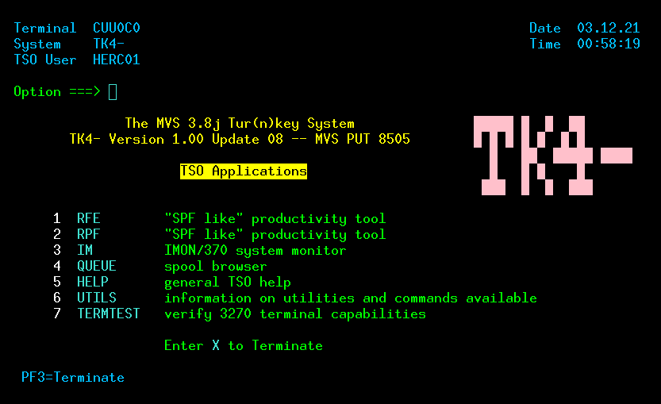

Enter '1' to access the RFE tool:

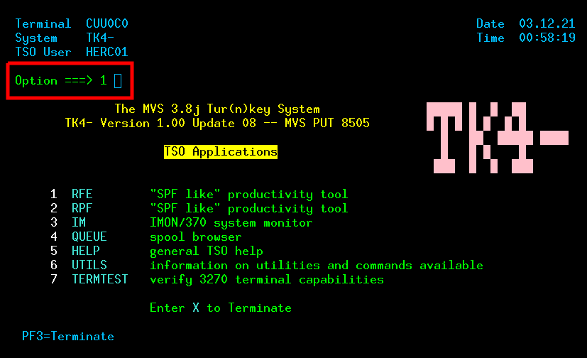

Enter '3' to access utility functions:

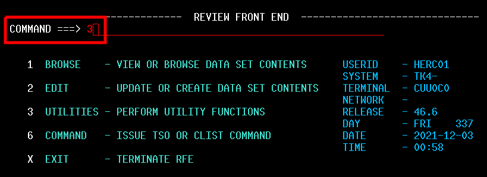

Enter '4' to access the Data Set list:

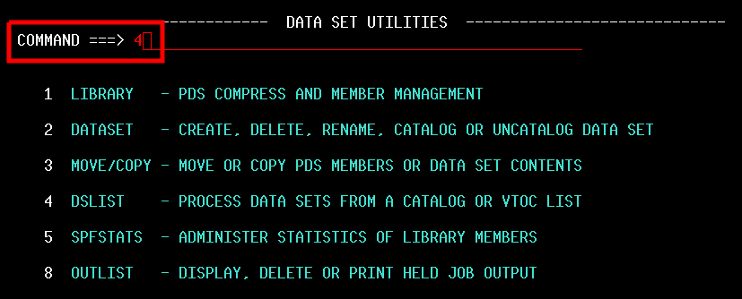

Enter 'SYS2.JCLLIB' to filter the Data Set list:

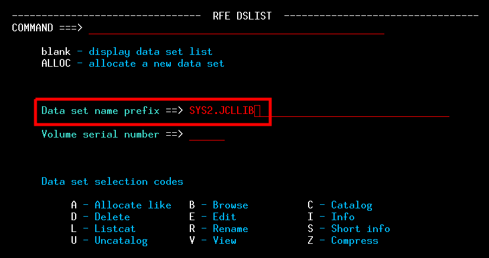

Tab to the detail line for SYS2.JCLLIB, then enter 'e' in the S column, for Edit:

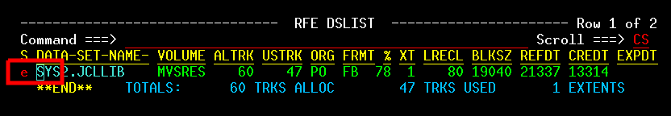

The Data Set list will display:

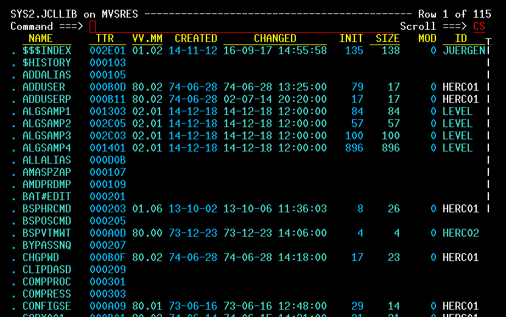

If you press [F8] (_page down_) a few times, you’ll see several Data Sets with names that begin with 'TEST'. These are test programs for various languages:

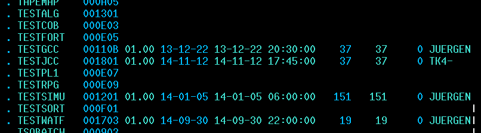

We’ll be using TESTCOB as a template for our COBOL job. We don’t want to use it directly, creating a copy instead. The first thing to do is to create a new, empty Data Set, with the name NEWCOB:

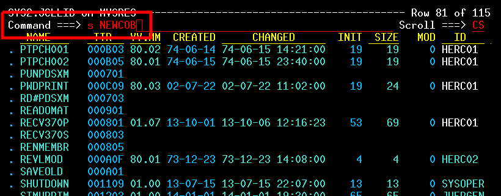

The new, empty Data Set opens in REVEDIT.

Next, we indicate that we want to populate it with a copy of the contents of TESTCOB:

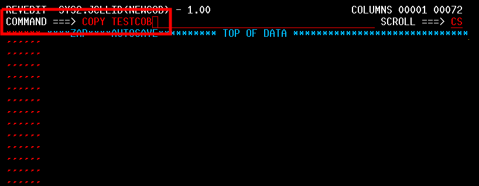

The editor will display the copied text:

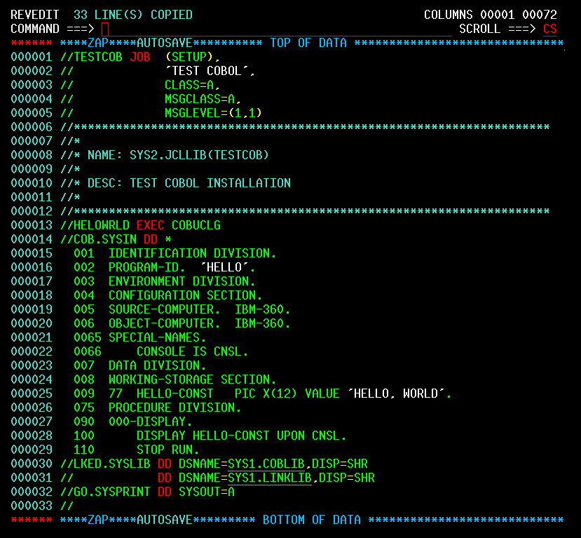

Make a few edits to the copied text. First, in line 0001, change TESTCOB to NEWCOB:

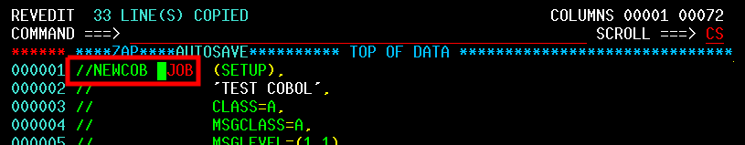

In line 0002, update the description:

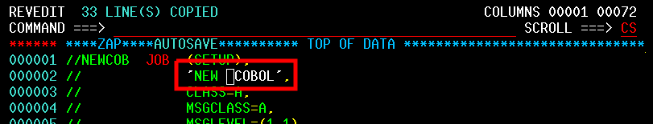

Finally, in line 0004, change the MSGCLASS to 'H':

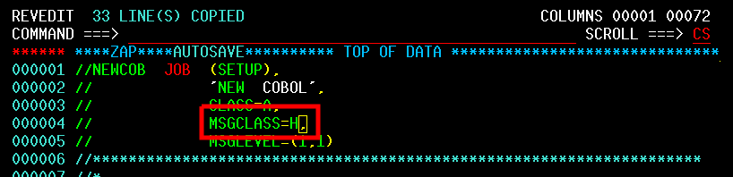

(This will ensure that the output from the job is retained and viewable after we run it)

Save your changes:

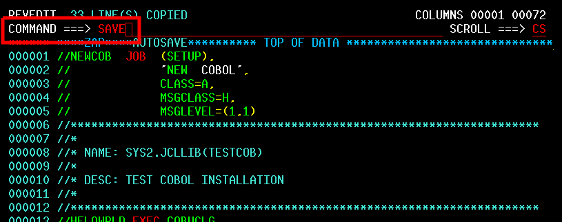

Submit the job:

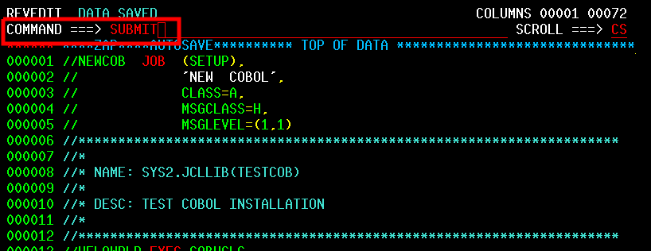

You’ll see a confirmation message, indicating that the job has been submitted:


### Check the Results

If you aren’t already on the main screen, press [F3] until it’s displayed:


Enter '1' to access the RFE tool:


Enter '3' to access utility functions:


Enter '8' to access held job output:

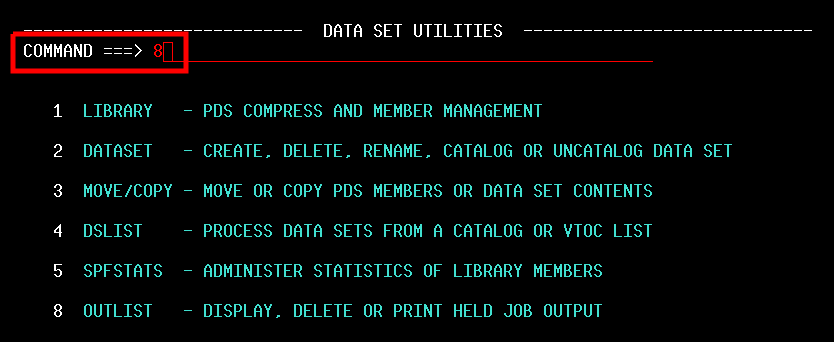

Enter 'ST *', indicating that you want to display all held jobs:

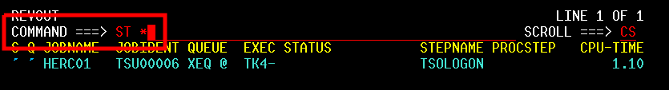

You’ll see 'NEWCOB', the job you recently submitted, at the end of the list:

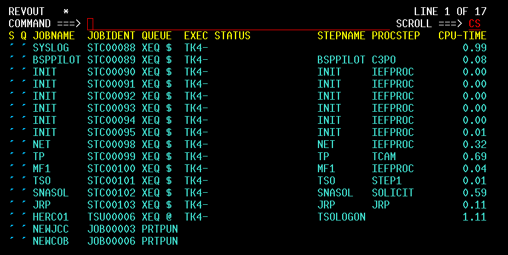

Enter 'S' in the S column for the NEWCOB job:

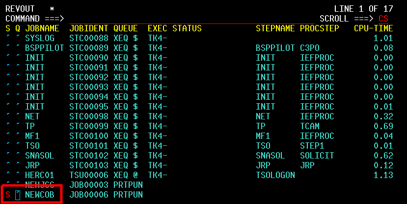

Job output is displayed:

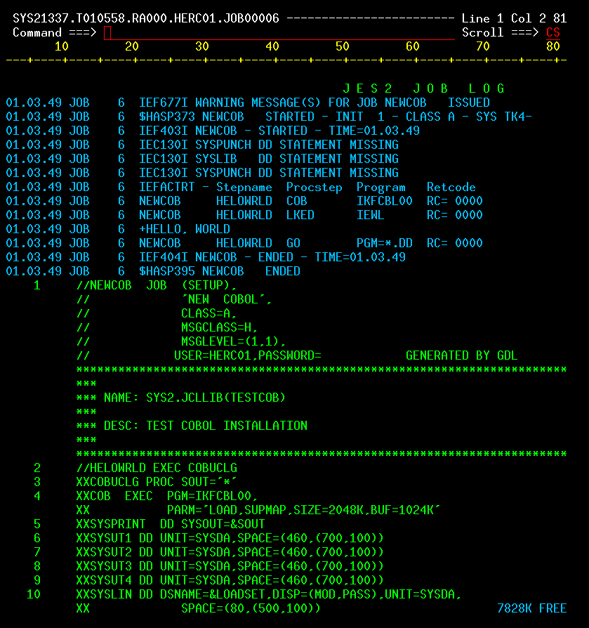

Press [F8] to page down, and you’ll see the 'Hello World' output:

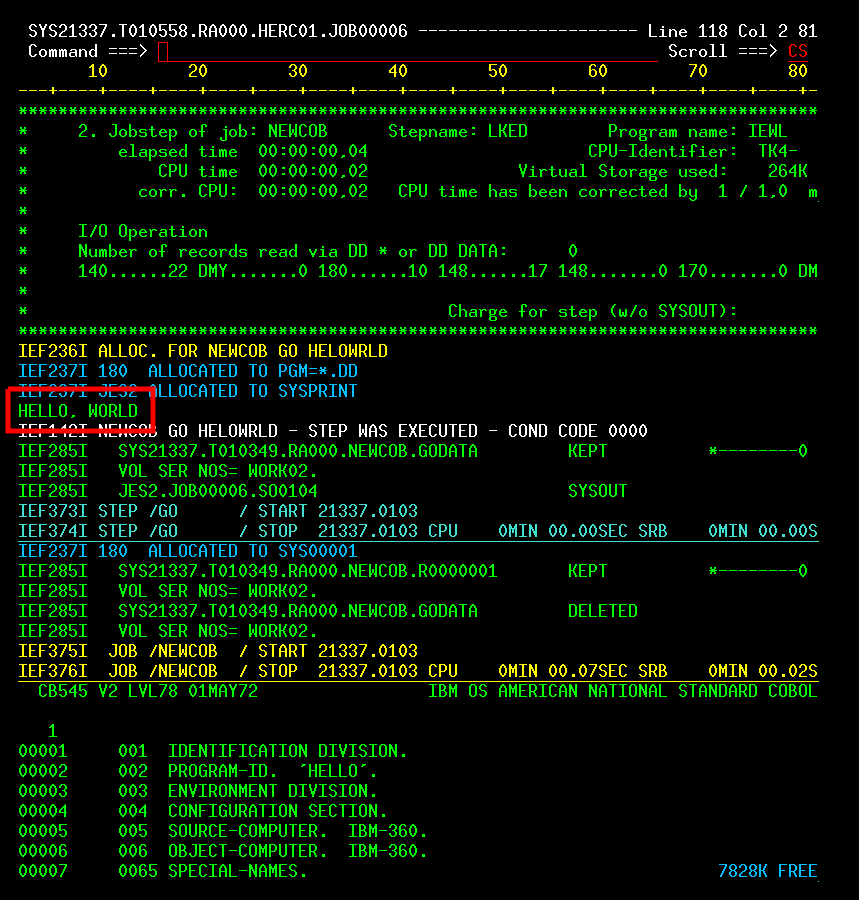

Press [F3] several times to return to the main screen.

## FORTRAN

FORTRAN first appeared in 1957. The latest stable release was in 2018. It’s widely used in scientific and engineering applications.

Follow the COBOL instructions, with the following differences:

1. Copy 'TESTFORT' instead of 'TESTCOB', and name it 'NEWFORT' instead of 'NEWCOB'.
2. When you edit NEWFORT, change the job name and description to indicate NEWFORT instead of NEWCOB.

## PL/1

You may also see the name written as 'PL/I'. It first appeared in 1964, and the latest stable release was in 2019.

Follow the COBOL instructions, with the following differences:

1. Copy 'TESTPL1' instead of 'TESTCOB', and name it 'NEWPL1' instead of 'NEWCOB'.
2. When you edit NEWPL1, change the job name and description to indicate NEWPL1 instead of NEWCOB.

There’s an additional change, and it’s important:

> [!IMPORTANT]
> There’s a critical “gotcha” in Pl/1 programs. MVS requires a JOBLIB statement in the JCL, and it’s not included in the turnkey sample programs. The following additional line is required in the Data Set. This should be added as a new line at the end of the JCL section:
>
> `//JOBLIB DD DSN=SYS1.PL1LIB,DISP=SHR`

> [!NOTE]
> To add a new line in the editor, enter an ‘I’ in the first column of a row, and the new row will be inserted after. Example location:

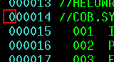

> [!TIP]
> You can also delete a line by entering a ‘D’ in the same location.

## C

C first appeared in 1972, and the latest stable release was in 2018. It’s the most actively used “old language” by far, heavily used in operating system and kernel development, device drivers, and embedded development.

It’s a dangerous language: Memory management is tricky. But, it’s also extremely powerful, as it’s well suited for getting close to the hardware.

Follow the COBOL instructions, with the following differences:

1. Copy 'TESTJCC' instead of 'TESTCOB', and name it 'NEWJCC' instead of 'NEWCOB'. **Use TESTJCC as your copy source, not TESTGCC. The GCC compiler ABENDs (throws an error) in the MVS Turnkey system.**
2. When you edit NEWJCC, change the job name and description to indicate NEWJCC instead of NEWCOB.
