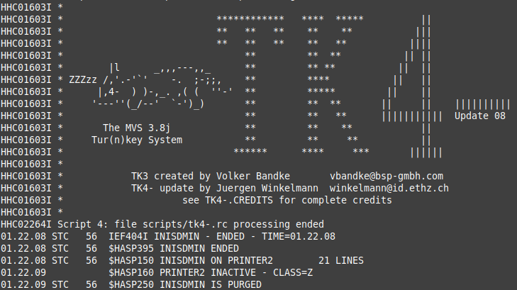
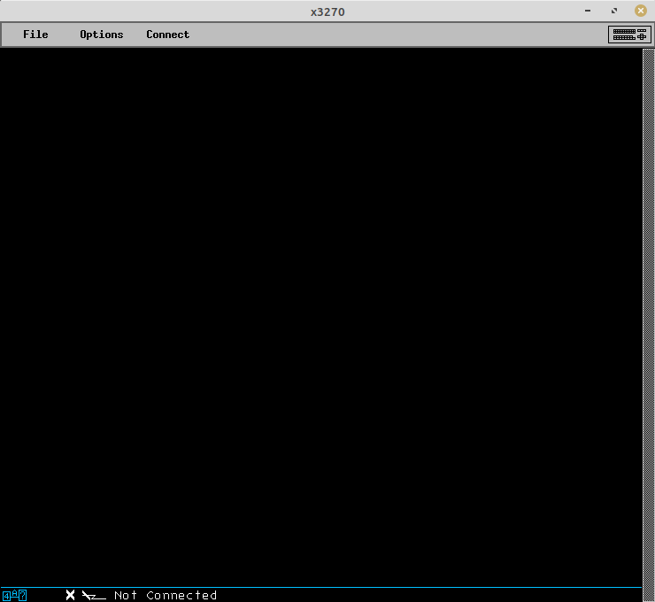
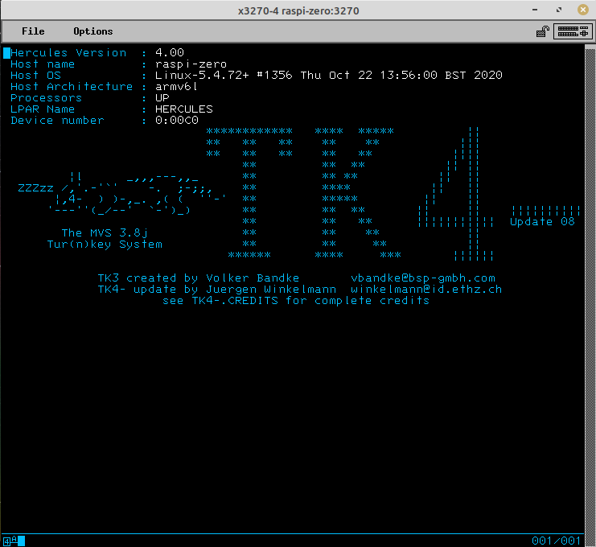
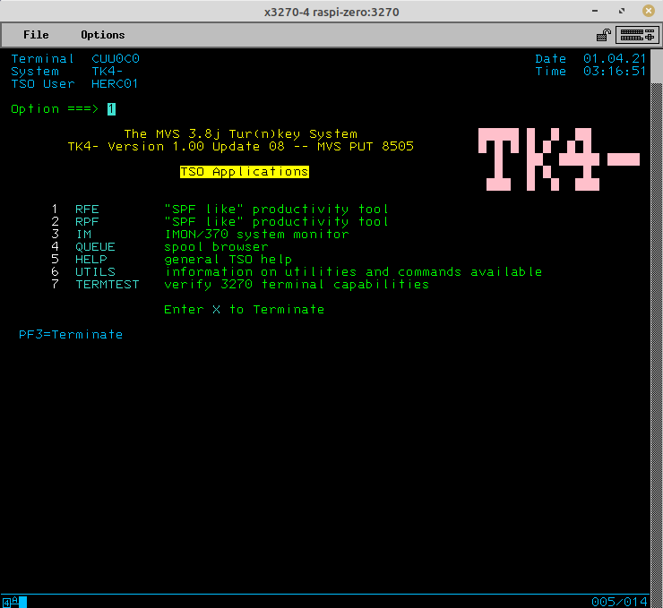

# Mainframe Emulation on Raspberry Pi Zero

## What You’ll Need

Item | Description
-----|-----
[MVS 3.8j Tur(n)key 4- System](http://wotho.ethz.ch/tk4-/) | Uses [Hercules](http://www.hercules-390.org/) to emulate an [IBM 3033](https://www.ibm.com/ibm/history/exhibits/3033/3033_intro.html) mainframe. The site has nice [detailed documentation](http://wotho.ethz.ch/tk4-/MVS_TK4-_v1.00_Users_Manual.pdf).
[Raspberry Pi Zero W](https://www.raspberrypi.org/products/raspberry-pi-zero-w/) | This is the host machine for your emulated mainframe. Assumes you’ve already set up the OS. I used [Raspbian](https://www.raspbian.org/).
Linux client system | This is the system you’ll use to connect to your emulated mainframe. I’m running Linux Mint 20.1 Cinnamon, but any distro should work. (Instructions do assume Debian-based tools, though.) You can also use Windows as your client system, but I’ll only be covering Linux setup in this article.
[x3270](http://x3270.bgp.nu/) | [IBM 3270](https://en.wikipedia.org/wiki/IBM_3270) terminal emulator for the X Window System and Windows.

Log in to your Raspberry Pi Zero W (or, [log in from your client machine using SSH](remote_access_rpi.md)). Stay in a console session (don’t load a window manager). The Zero is pretty resource constrained, so we don’t want a GUI chewing up memory and CPU cycles.

Retrieve the MVS 3.8j Tur(n)key 4- System installation archive:

```bash
wget http://wotho.ethz.ch/tk4-/tk4-_v1.00_current.zip
```

Install (change the path to the zip as needed):

```bash
cd /opt
 
sudo mkdir mvs
 
sudo unzip /home/pi/Downloads/tk4-_v1.00_current.zip -d /opt/mvs/
```

Start (unattended mode):

```bash
cd /opt/mvs
 
sudo ./mvs
```

Startup can take several minutes. You’ll know it’s completed when you see a screen similar to this:



Leave the mvs script running.

## Client Terminal (client machine)

Install x3270:

```bash
sudo apt install x3270
```

…and run it:



Click the “Connect” menu option, and connect to raspi-machine:3270 (raspi-machine should be changed to whatever host name your Raspberry Pi was set up with.) If it can’t resolve, you may need to use the IP address, or add an entry for your Raspberry Pi to your /etc/hosts file.

## Logon a TSO Session



In this case press the 3270 RESET key followed by the CLEAR key to display the logon panel (RESET is needed if the keyboard is locked only). Otherwise the logon panel is displayed immediately.

> [!TIP]
> For special x3270 keys, like RESET, CLEAR, and PF3, click the keyboard icon in the upper-right corner of the x3270 application, and you’ll be presented with a keypad.

Logon with one of the following users:

* HERC01 is a fully authorized user with full access to the RAKF users and profiles tables. The logon password is CUL8TR.
* HERC02 is a fully authorized user without access to the RAKF users and profiles tables. The logon password is CUL8TR.
* HERC03 is a regular user. The logon password is PASS4U.
* HERC04 is a regular user. The logon password is PASS4U.
* IBMUSER is a fully authorized user without access to the RAKF users and profiles tables. The logon password is IBMPASS. This account is meant to be used for recovery purposes only.

After the “Welcome to TSO” banner has been displayed, press ENTER. The system will entertain you with a fortune cookie. Press ENTER again. The TSO applications menu will display:



Congratulations! You’ve successfully configured your mainframe, and logged in to an operator session.

## Logoff a TSO Session

1. Exit any active application.
2. Press PF3 to exit to the READY prompt.
3. Enter logoff and press ENTER. The tn3270 session will not drop and the logon panel will be redisplayed. Disconnect the tn3270 session manually if you don’t want to logon again or enter a userid to relogon.

## Stop the System

1. Logon TSO user HERC01 or HERC02.
2. Press PF3 from the TSO Applications menu to exit to the READY prompt.
3. Type shutdown and press ENTER.
4. Enter logoff and press ENTER.

After pausing 30 seconds the automated shutdown procedure will bring the system down and quit Hercules (which is equivalent to powering off the IBM 3033 mainframe).

## What’s Next?

Now that your mainframe is up and running, what can you do with it? Things like:

* [Run jobs with JCL](jcl_programming_mvs.md)
* Manage queues
* Printing
