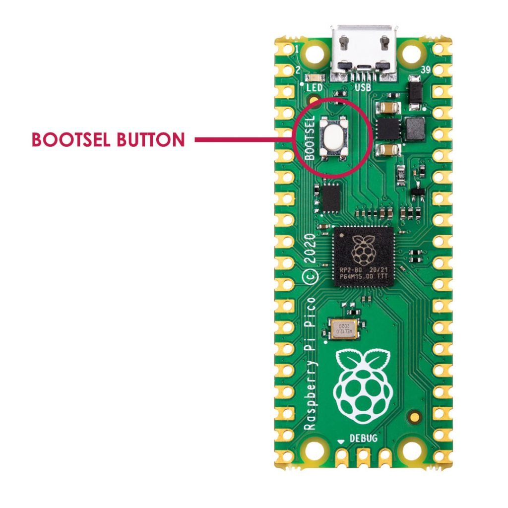

# Programming Arduino (AVR) and Raspberry Pi Pico (ARM) in C

This article will document the steps required to blink the onboard LED (the “Hello World” of the hobbyist microcontroller world) on Arduino UNO and Raspberry Pi Pico boards.

This will use standards-compliant C code in a CLI environment.

## Arduino (AVR)

AVR chips are used on Arduino boards. This section assumes that you’re using an Arduino Uno. If you’re using something else, you’ll need to update the command line arguments for avr-gcc and avrdude to reflect the chip model.

### Requirements

Instructions assume a Debian-based system.

Required packages:

Package Name | Description
-----|-----
binutils | The programs in this package are used to assemble, link and manipulate binary and object files. They may be used in conjunction with a compiler and various libraries to build programs.
gcc-avr | This is the GNU C compiler for AVR, a fairly portable optimizing compiler which supports multiple languages. This package includes support for C.
gdb-avr | This package has been compiled to target the avr architecture.  GDB is a source-level debugger, capable of breaking programs at any specific line, displaying variable values, and determining where errors occurred. Currently, it works for C, C++, Fortran Modula 2 and Java programs. A must-have for any serious programmer.  This package is primarily for avr developers and cross-compilers and is not needed by normal users or developers.
avr-libc | Standard library used for the development of C programs for the Atmel AVR micro controllers. This package contains static libraries as well as the header files needed.
avrdude | AVRDUDE is an open source utility to download/upload/manipulate the ROM and EEPROM contents of AVR microcontrollers using the in-system programming technique (ISP)

Installation:

```bash
sudo apt install binutils gcc-avr gdb-avr avr-libc avrdude
```

### Source

blink.c
```c
#include <avr/io.h> // defines pins and ports
#include <util/delay.h>
    
#define BLINK_DELAY 500 // number of milliseconds to wait between LED toggles.
    
int main(void) {
    DDRB |= (1 << PB5); // Data Direction Register B: writing a 1 to the Pin B5
                        // bit enables output
    
    // Event loop (runs forever)
    while (1) {
    PORTB = 0b00100000; // turn on 5th LED bit/pin in PORT B (Pin13 in Arduino)
    _delay_ms(BLINK_DELAY);
    
    PORTB = 0b00000000; // turn off all bits/pins on PB
    _delay_ms(BLINK_DELAY);
    }
    
    return (0); // main() requires a return value, but this will never happen, as
                // the polling loop is infinite.
}
```

Makefile
```makefile
FORMATTER = clang-format -i
ROOT_FILE_NAME = blink
SRC_FILE = $(ROOT_FILE_NAME).c
OBJ_FILE = $(ROOT_FILE_NAME).o
EXE_FILE = $(ROOT_FILE_NAME)
HEX_FILE = $(ROOT_FILE_NAME).hex
    
default:
    @echo 'Targets:'
    @echo '  compile'
    @echo '  link'
    @echo '  hex'
    @echo '  upload'
    @echo '  format'
    @echo '  clean'
    
$(OBJ_FILE): $(SRC_FILE)
    avr-gcc -Os -DF_CPU=16000000UL -mmcu=atmega328p -c -o $(OBJ_FILE) $(SRC_FILE)
    
compile: $(OBJ_FILE)
    
$(EXE_FILE): $(OBJ_FILE)
    avr-gcc -mmcu=atmega328p $(OBJ_FILE) -o $(EXE_FILE)
    
link: $(EXE_FILE)
    
$(HEX_FILE): $(EXE_FILE)
    avr-objcopy -O ihex -R .eeprom $(EXE_FILE) $(HEX_FILE)
    
hex: $(HEX_FILE)
    
upload: $(HEX_FILE)
    avrdude -F -V -c arduino -p ATMEGA328P -P /dev/ttyACM0 -b 115200 -U flash:w:$(HEX_FILE)
    
format:
    $(FORMATTER) $(SRC_FILE)
    
clean:
    -rm -f $(OBJ_FILE) $(EXE_FILE) $(HEX_FILE) $(SRC_FILE).orig
```

### Build and Upload

To build the code, and upload to the Arduino, first plug in your Arduino board, and then:

```bash
make upload
```

What’s going on:

1. avr-gcc produces an object file compatible with the AVR chipset, and then links it into a binary.
2. Only the hex code is used by the chip, so avr-objcopy extracts it.
3. avrdude uploads the hex code to the board.

## Raspberry Pi Pico (ARM Cortex)

### Requirements / Setup

```bash
cd ~/
 
mkdir pico
 
cd pico
```

Clone the pico-sdk and pico-examples repositories:

```bash
git clone -b master https://github.com/raspberrypi/pico-sdk.git
 
cd pico-sdk
 
git submodule update --init
 
cd ..
 
git clone -b master https://github.com/raspberrypi/pico-examples.git
```

Install the toolchain:

```bash
sudo apt update
 
sudo apt install cmake gcc-arm-none-eabi libnewlib-arm-none-eabi build-essential
```

### Build

Create a build directory:

```bash
cd pico-examples
 
mkdir build
 
cd build
```

Set the SDK path:

```bash
export PICO_SDK_PATH=../../pico-sdk
```

Prepare the CMAKE build directory:

```bash
cmake ..
```

Build:

```bash
cd blink
 
make -j4
```

This produces the following outputs:

* **blink.elf** - This is used by the debugger
* **blink.uf2** - This is the file to be uploaded to the RP2040

### Load and Run

To load a .uf2 file onto the Pico, the board must be in BOOTSEL mode. To accomplish this:

1. Hold down the BOOTSEL button on the Pico.
2. Plug the micro USB cable into the Pico.
3. Release the BOOTSEL button.



The Pico will mount as a USB mass storage device. To load the binary code we just created, drag and drop the blink.uf2 file to the mounted drive. The UF2 file will be loaded on the Pico, and the drive will automatically unmount.

> [!TIP]
> If you want to load an updated UF2 file to the board, you must go through the same BOOTSEL steps, after first unplugging the board.

It can be a pain, having to unplug the board and plug it back in (in BOOTSEL mode) every time you want to apply an update. I recommend purchasing a microUSB cable with a switch. Then, instead of unplugging and plugging the cable every time, your BOOTSEL steps become:

1. Switch off the micro USB cable.
2. Hold down the BOOTSEL button on the Pico.
3. Switch on the micro USB cable.
4. Release the BOOTSEL button.

Make sure you purchase a cable that supports data transfer, not just power. This is the one I’m using, but any micro USB cable with data support should work.

### The Code

blink.c
```c
#include "pico/stdlib.h"
    
int main() {
#ifndef PICO_DEFAULT_LED_PIN
#warning blink example requires a board with a regular LED
#else
    const uint LED_PIN = PICO_DEFAULT_LED_PIN; // Default PIN number for the built-in LED
    
    gpio_init(LED_PIN); // Initialize the LED
    
    gpio_set_dir(LED_PIN, GPIO_OUT);
    
    // Never-ending polling loop
    while (true) {
        // Turn on the LED, then wait 1/2 second
        gpio_put(LED_PIN, 1);
        sleep_ms(500);
    
        // Turn off the LED, then wait 1/2 second
        gpio_put(LED_PIN, 0);
        sleep_ms(500);
    }
#endif
}
```
