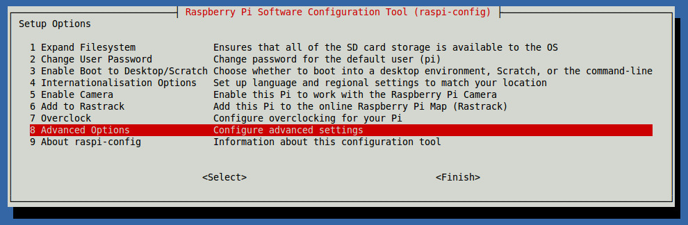
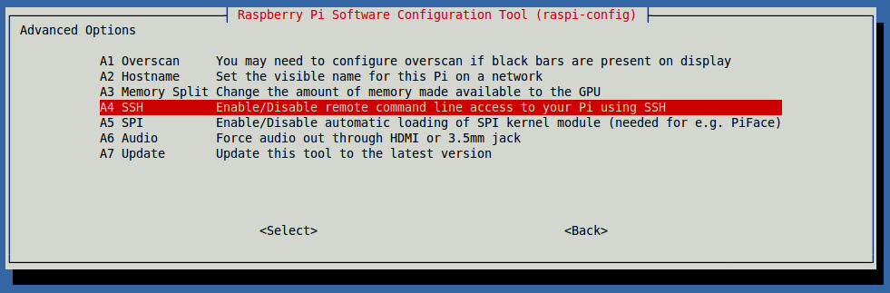
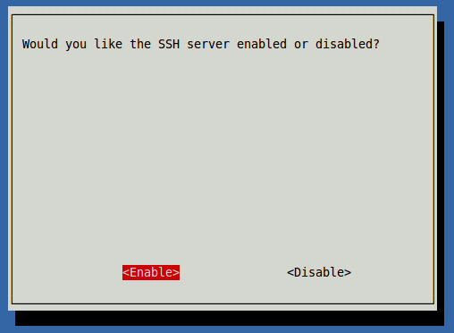
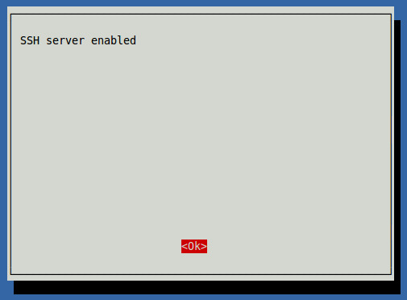
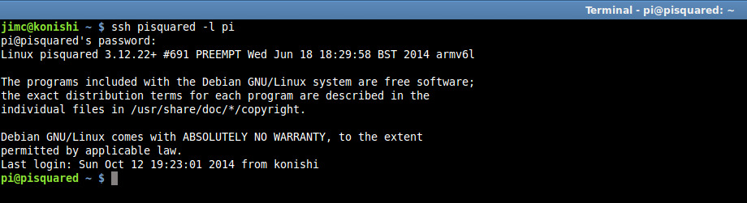
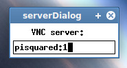
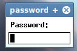
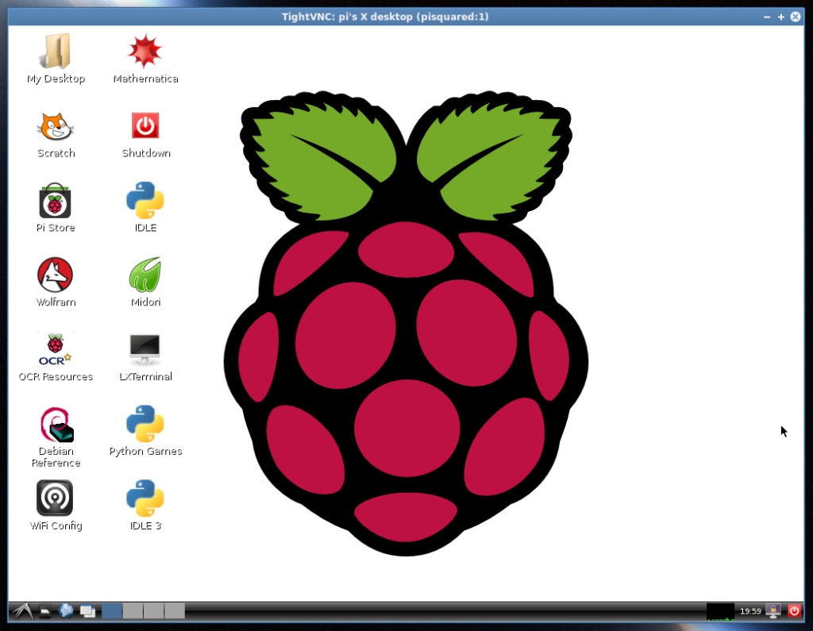

# Remote Access for Raspberry Pi

If you’d like the ability to control your Pi from another computer, there are a couple of options available.

The first, and simplest, is SSH access. This will give you remote access via the command line.

## SSH (Command Line Access)

### SSH Setup

First, the SSH server needs to be enabled on the Pi. Start up the Pi and log in. Then, run `raspi-config`:

```bash
sudo raspi-config
```

On the initial screen, select “Advanced Options”:



On the Advanced screen, select “SSH”:



Select “Enable” to activate the SSH server:



If activation was successful, you’ll see this:



Exit raspi-config and restart the Pi.

After the Pi restarts, log in and use ifconfig to determine its IP address (You’ll need this for SSH access.):

```bash
sudo ifconfig
```

If you have the Pi hard-wired to your network, look for the IP address in the “eth#” section. If you are using a wireless adapter, look for the IP address in the “wlan#” section.

### Client Access

Switch to the computer from which you want to access the Pi. (These instructions will assume a Linux client.)

Open a terminal and issue the following command:

```bash
ssh 192.168.1.13 -l pi
```

(Change the IP address in the command to match that of your Pi.)

You can also add an entry to the /etc/hosts file on your client machine if you’d like a “friendly name” to use when logging in. My Pi has a host name of “pisquared”, so I added an entry for this so that I can log in as follows:

```bash
ssh pisquared -l pi
```

You’ll be prompted for your Pi user’s password. After entering it, you should be sitting at a command line on the Pi. Example:



The first time you log in to the Pi, you’ll get a warning about it not being a known host. Answer “yes” to the prompt so that you won’t be warned again.

When you are finished with your session, type “exit” and [Enter] to log out and return to the client machine.

### Secure File Copy

With SSH enabled, you can also use scp (Secure File Copy) to copy files between systems.

The scp command works very similarly to the cp command. For example, let’s assume you want to copy files from your host system to your Raspberry Pi, with the following setup:

* The hostname of the Raspberry Pi is “raspberry”.
* The username on the Raspberry Pi is “pi”.
* Your username on the host system is “johnd”.
* You want to copy all of the files in the “/home/johnd/transfer” directory on your host system to the “/home/pi/transfer” directory on the Raspberry Pi.

(Modify the values above as needed for your configuration.)

The command to accomplish this is:

```bash
scp /home/johnd/transfer/* pi@raspberry:/home/pi/transfer
```

You’ll be prompted for the password of the “pi” user, then the files will be copied, with a nice progress display.

If you want to copy files from the Raspberry Pi to your host system, it’s as easy as this:

```bash
scp pi@raspberry:/home/pi/transfer/* /home/johnd/transfer
```

## VNC (Access with Graphical Interface)

If you’d like to access your Pi via a graphical interface, VNC provides the means.

### VNC Server

First, you’ll need to install a VNC server on your Pi. Log in to the Pi, then issue these commands:

```bash
sudo apt-get update
 
sudo apt-get install tightvncserver
```

After installation is complete, start the VNC server as follows:

```bash
vncserver :1
```

You’ll be prompted to enter a password to use when accessing desktops. You are limited to 8 characters on the password. If you want separate read-only access, answer “y” to the “view-only password” prompt, otherwise answer “n”.

### Client Access

To access the Pi from your client machine, you’ll need a VNC client. I’m using [xtightvncviewer](http://pwet.fr/man/linux/commandes/xtightvncviewer) here, but there are plenty to choose from.

When you run the VNC viewer, you’ll be prompted for the address of the machine to connect to. Enter the IP address of your Pi, or the “friendly name” from your hosts file if you prefer. Append a “:1″ to indicate the port to connect to:



Then, you’ll be prompted for the remote access password you set up earlier:



After entering the password, the graphical desktop will display:



That’s it! When you’re finished, just close the VNC viewer.

## All-In-One Client

If you’d like a nice all-in-one SSH/VNC client for Linux, I recommend [Remmina](https://remmina.org/).
