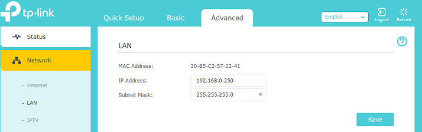
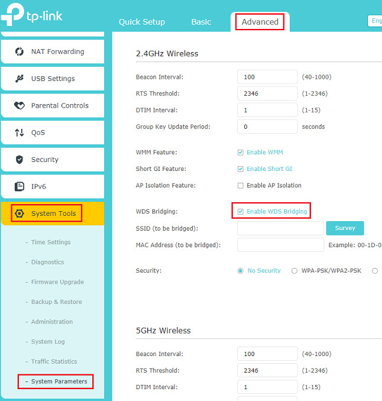
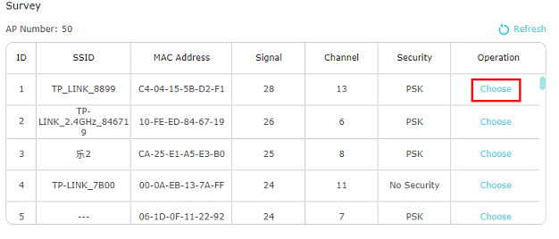
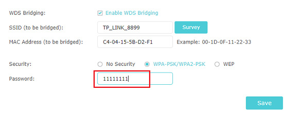
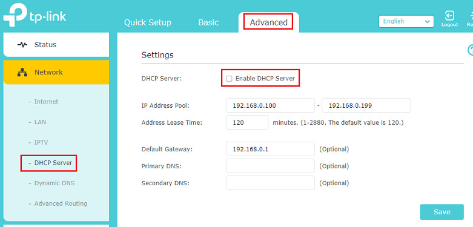

# Using Your Router As A Wireless Repeater

> For reference, the Archer router will be the one acting as the repeater. The main router is your existing router or ISP router etc.

1. Factory default the Archer router by holding the reset button for 15 seconds then release. Leave the Archer router in the same room of the main router.

2. Now you need to know the IP addressing subnet of your main router. For example, if you connect to your main router and you get an IP of 192.168.0.100, then the Archer router will be getting an IP of 192.168.0.250. It does not need to be .250, you can choose any number if it is not within your DHCP pool.

3. Use a computer where you can use an Ethernet cable to connect to one of the LAN ports of the Archer router and log into it. No other Ethernet cable needs to be connected, just the one from your computer.

4. Set the IP address of the Archer router. In the example below I am assuming my main router gives an IP of 192.168.0.x, select Save. You will probably get disconnected if so log back in with the new IP address given to the Archer router.

5. Set up the WDS bridging which will connect the Archer router to the main router. Select the survey button and choose the network you want to connect to. You can only connect to either the 2.4GHz or the 5GHz. After you choose the network, enter the wireless password that you would normally use to connect to that wireless network. Say for example a visitor came over and wanted to connect to that same network, whichever wireless password you would use is what you enter there. Make sure to select the save button when you are done.

6. Disable the DHCP server and save it.

7. Reboot the router either by selecting the reboot on the top right or pressing the power button behind the router and turning it back on.

---

Source: <https://community.tp-link.com/us/home/kb/detail/396>